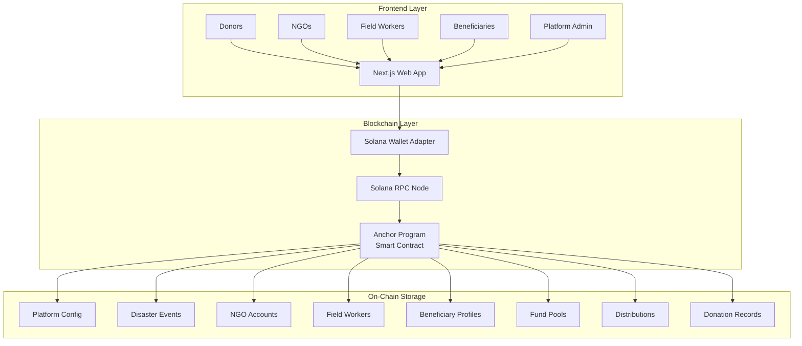
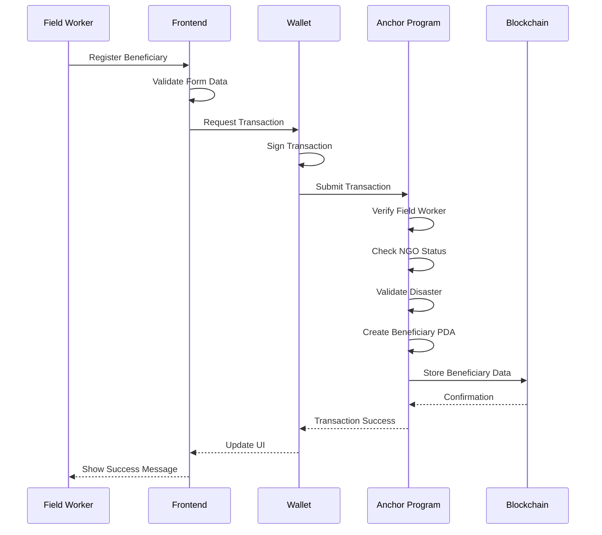
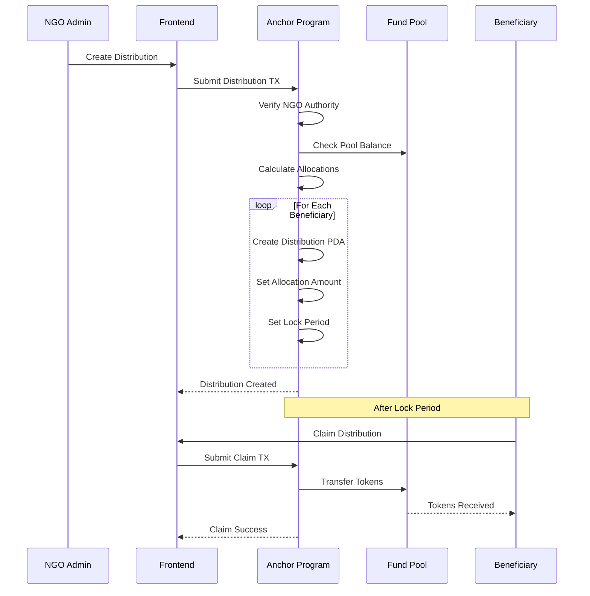

<div align="center">
  
  
  # Sahara - Decentralized Disaster Relief Platform
  
  > Transparent, instant, and trustless disaster relief on Solana blockchain
  
  [](https://solana.com)
  [](https://www.anchor-lang.com/)
  [](https://nextjs.org/)
  [](https://www.typescriptlang.org/)
  [](LICENSE)
</div>

## Table of Contents

- [Overview](#overview)
- [Demo](#demo)
- [Problem Statement](#problem-statement)
- [Solution](#solution)
- [Key Features](#key-features)
- [Architecture](#architecture)
- [Tech Stack](#tech-stack)
- [Getting Started](#getting-started)
- [Project Structure](#project-structure)
- [User Roles](#user-roles)
- [Production Deployment](#production-deployment)
- [Contributing](#contributing)
- [Roadmap](#roadmap)
- [License](#license)

## Overview

**Sahara** is a blockchain-based disaster relief platform built on Solana that enables direct, transparent, and instant aid distribution to verified disaster victims in Nepal. By leveraging blockchain technology, we eliminate middlemen, reduce overhead costs, and ensure every dollar reaches those who need it most.

**Program ID (Devnet):** `6Ke32uyhxtjAPP7BBRD2SjzmpATL6sAdNg9v7rxyvmU1`

## Problem Statement

Traditional disaster relief systems face critical challenges:

- **Slow Distribution**: Aid takes weeks to reach victims
- **High Overhead**: 30-40% lost to administrative costs
- **Lack of Transparency**: Donors can't track their contributions
- **Corruption**: Funds diverted or mismanaged
- **Coordination Issues**: Multiple NGOs working in silos
- **Verification Delays**: Lengthy beneficiary verification processes

## Solution

Sahara solves these problems through:

### Blockchain-Native Architecture

- **Direct Transfers**: Wallet-to-wallet aid distribution
- **Instant Finality**: Solana's sub-second transaction confirmation
- **Zero Middlemen**: No intermediaries between donors and beneficiaries
- **Complete Transparency**: All transactions visible on-chain

### Multi-Signature Verification

- **3-of-5 Approval System**: Prevents fraud and ensures legitimacy
- **Field Worker Network**: On-ground verification by trusted NGO staff
- **Immutable Records**: Blockchain-based identity and verification

### Transparent Fund Management

- **Fund Pools**: Disaster-specific pools with clear distribution rules
- **Real-Time Tracking**: Live updates on donations and distributions
- **Smart Contracts**: Automated, trustless fund distribution

## Demo

### Platform Walkthrough

**Platform Initialization** (Admin Setup)

[Platform Initializations.webm](https://github.com/user-attachments/assets/b4427d12-ee5c-45bc-9f77-845b81bd53b4)

- Admin dashboard setup
- Platform configuration
- Initial system setup

**NGO Registration**

[NGO Registration.webm](https://github.com/user-attachments/assets/9bf397bc-08ab-4d62-adde-58cab5ce1099)

- NGO registration process
- Organization details submission
- Wallet connection and registration

**NGO Verification & Management** (Admin Actions)

[NGO Verifications Admin Action Logs.webm](https://github.com/user-attachments/assets/f2622d29-a23b-4d43-aaff-7663a9f1817b)

- Single NGO verification
- Batch verification of multiple NGOs
- Activate/Deactivate NGO status
- Transaction logs and audit trail

**Creating Disaster Event** (NGO Action)

[Disasters Creation.webm](https://github.com/user-attachments/assets/c31782a3-7150-4f09-a955-b7a3c5ccfbb6)

- NGO creates disaster event with details
- Location, severity, and affected areas
- Edit/delete permissions (only for creator NGO)
- Other NGOs can view but cannot modify disasters they didn't create

**Creating Fund Pool & Donations** (NGO Action)

[Disaster Pool Creation & Donations.webm](https://github.com/user-attachments/assets/99f938d3-779c-48d6-917b-ceb4b19b7b2d)

- NGO creates fund pool linked to disaster
- Set pool details and funding goals
- Token type selection (USDC/SOL)
- Donors can contribute to the pool
- Real-time donation tracking

**Field Worker Registration** (NGO Action)

[NGO Field Worker Registrations.webm](https://github.com/user-attachments/assets/0ff77e66-07ee-4b1f-9475-21d548ffc23a)

- NGO registers field workers
- Assign districts and credentials
- Field worker activation
- Worker management dashboard

**Beneficiary Registration & Verification**

[Beneficiaries Registration by Field Workers & Verification.webm](https://github.com/user-attachments/assets/4772a59a-2a98-4fd5-9e9c-630d7194202f)

- Field worker registers beneficiaries
- Multi-signature verification process
- Beneficiary approval workflow
- Verification dashboard

**Fund Distribution & Claims** (NGO Action & Beneficiary)

[Pool Distribution and claiming.webm](https://github.com/user-attachments/assets/dcdbaf15-ac93-4995-9733-475aa43fbd30)

- NGO distributes funds to beneficiaries
- Beneficiary claims distribution
- Immediate and time-locked funds
- Transaction tracking
- Admin audit logs and activity monitoring

### Test Accounts

For testing purposes, you can use the following pre-configured account:

> **⚠️ Test Account Only**: This is a test wallet for demonstration purposes on Devnet. Do not use on Mainnet or send real funds.

**Verified NGO Account:**

```
Private Key: 2izCjxjHXU4jspqEnasEh6QSyRj1CgNKBvHjv6wmzaiyFMNjNyqWF2qV7dtSFUvZ1b16jkvqiLqAiJCbXfHLu4Ba
```

This account is already registered and verified as an NGO on the platform. You can import it into your Solana wallet (Phantom, Solflare, etc.) to test NGO features such as:

- Creating disaster events
- Registering field workers
- Creating fund pools
- Distributing funds to beneficiaries

## Key Features

### For Platform Admins

- **Platform Configuration**: Manage fees and thresholds
- **NGO Verification**: Approve registered NGOs
- **Emergency Controls**: Pause platform in emergencies
- **Analytics Dashboard**: Monitor platform statistics

### For NGOs

- **Field Worker Management**: Register and manage verification staff
- **Fund Pool Creation**: Set up transparent relief funds
- **Beneficiary Registration**: Register disaster victims
- **Distribution Management**: Allocate funds to beneficiaries

### For Field Workers

- **Beneficiary Verification**: Participate in multi-sig approval
- **On-Ground Registration**: Register victims in disaster zones
- **Verification Dashboard**: Track approval status

### For Beneficiaries (Disaster Victims)

- **Direct Aid Reception**: Receive USDC/SOL directly to wallet
- **Instant Access**: Claim funds immediately after distribution
- **Transparent History**: View all received aid on-chain
- **Mobile-First**: PWA with offline support (future)

### For Donors

- **Direct Donations**: Send aid directly to verified victims
- **Pool Donations**: Contribute to disaster-specific fund pools
- **Real-Time Tracking**: See exactly where your money goes
- **Tax Receipts**: On-chain donation records (future)

## Architecture

### System Overview



### Beneficiary Registration Flow



### Fund Distribution Flow



### Data Storage

All data stored on-chain in Solana accounts (no traditional database):

- **Platform Config**: Settings, admin, statistics
- **Disasters**: Event details, location, severity
- **NGOs**: Organization info, verification status
- **Field Workers**: Credentials, assigned districts
- **Beneficiaries**: Personal info, verification, approvals
- **Fund Pools**: Balances, distribution rules
- **Distributions**: Allocations, claim status
- **Donation Records**: Transaction history

## Tech Stack

- **Blockchain**: Solana + Anchor 0.31.1 (Rust)
- **Frontend**: Next.js 16 + TypeScript 5.9
- **UI**: Tailwind CSS 4 + shadcn/ui
- **Wallet**: Solana Wallet Adapter

## Getting Started

For detailed setup and deployment instructions, please refer to the **[Complete Setup Guide](SETUP.md)**.

### Quick Start

1. **Clone the repository**

```bash
git clone https://github.com/exyreams/sahara.git
cd sahara
```

2. **Follow the setup guide**

See [SETUP.md](SETUP.md) for:

- Prerequisites and installation
- Local development (Localnet) setup
- Devnet deployment
- Testing instructions
- Troubleshooting tips

### Test Accounts

For testing purposes, you can use the following pre-configured account:

> **⚠️ Test Account Only**: This is a test wallet for demonstration purposes on Devnet. Do not use on Mainnet or send real funds.

**Verified NGO Account:**

```
Private Key: 2izCjxjHXU4jspqEnasEh6QSyRj1CgNKBvHjv6wmzaiyFMNjNyqWF2qV7dtSFUvZ1b16jkvqiLqAiJCbXfHLu4Ba
```

This account is already registered and verified as an NGO on the platform. You can import it into your Solana wallet (Phantom, Solflare, etc.) to test NGO features such as:

- Creating disaster events
- Registering field workers
- Creating fund pools
- Distributing funds to beneficiaries

## Project Structure

```
sahara/
├── sahara-core/          # Anchor program (Solana smart contracts)
│   ├── programs/
│   │   └── sahara-core/
│   │       ├── src/
│   │       │   ├── lib.rs           # Program entry point
│   │       │   ├── state/           # Account structures
│   │       │   └── instructions/    # Instruction handlers
│   │       └── Cargo.toml
│   ├── tests/            # Integration tests
│   └── Anchor.toml       # Anchor configuration
│
├── frontend/             # Next.js web application
│   ├── app/              # Next.js App Router pages
│   ├── components/       # React components
│   ├── hooks/            # Custom React hooks
│   ├── lib/              # Utilities & Anchor setup
│   └── types/            # TypeScript types
│
└── README.md
```

## User Roles

### 1. Beneficiaries (Disaster Victims)

- Register with field worker assistance
- Get verified through multi-sig process
- Receive direct donations
- Claim distributions from fund pools
- View donation history

### 2. Donors

- Browse verified beneficiaries
- Make direct donations (USDC/SOL)
- Donate to fund pools
- Track donation impact
- View transaction history

### 3. NGOs

- Register organization
- Manage field workers
- Create fund pools
- Distribute funds to beneficiaries
- View organization statistics

### 4. Field Workers

- Register beneficiaries
- Verify beneficiaries (multi-sig)
- View verification dashboard
- Track registrations

### 5. Platform Admin

- Configure platform settings
- Verify NGOs
- Manage disasters
- Emergency pause controls
- View platform analytics

## Contributing

We welcome contributions! Please see our [Contributing Guidelines](CONTRIBUTING.md) for details.

### Development Workflow

1. Fork the repository
2. Create a feature branch (`git checkout -b feature/amazing-feature`)
3. Commit your changes (`git commit -m 'Add amazing feature'`)
4. Push to the branch (`git push origin feature/amazing-feature`)
5. Open a Pull Request

## License

This project is licensed under the MIT License - see the [LICENSE](LICENSE) file for details.

## 🙏 Acknowledgments

- **Solana Foundation** for the amazing blockchain platform
- **Anchor Framework** for simplifying Solana development
- **shadcn/ui** for beautiful UI components
- **Nepal Red Cross** for inspiration and domain knowledge

## Contact

- **GitHub**: [@exyreams](https://github.com/exyreams)
- **Project**: [github.com/exyreams/sahara](https://github.com/exyreams/sahara)

## Roadmap

### Phase 1: MVP (Current)

- Core smart contracts
- Frontend application
- Multi-sig verification
- Fund pools and distributions
- Devnet deployment

### Phase 2: Production

- Mainnet deployment
- Mobile PWA
- SMS interface for non-smartphone users
- Database indexer for performance
- Analytics dashboard

### Phase 3: Scale

- Multi-country support
- NFT-based identity
- Integration with traditional NGOs
- Government partnerships
- Impact reporting tools

---

**Built with ❤️ for disaster relief transparency**

_Making every donation count, one block at a time_
