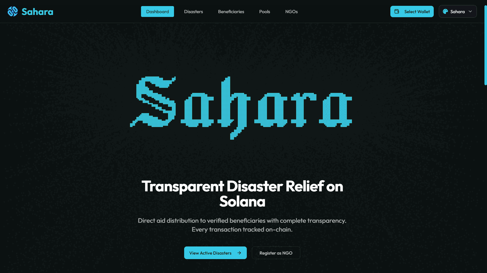

<div align="center">
  
  
  # Sahara - Decentralized Disaster Relief Platform
  
  > Transparent, instant, and trustless disaster relief on Solana blockchain
  
  [](https://solana.com)
  [](https://www.anchor-lang.com/)
  [](https://nextjs.org/)
  [](https://www.typescriptlang.org/)
  [](LICENSE)
</div>

## Table of Contents

- [Overview](#overview)
- [Demo](#demo)
- [Problem Statement](#problem-statement)
- [Solution](#solution)
- [Key Features](#key-features)
- [Architecture](#architecture)
- [Tech Stack](#tech-stack)
- [Getting Started](#getting-started)
- [User Roles](#user-roles)
- [Known Bugs & Limitations](#known-bugs--limitations)
- [Contributing](#contributing)
- [Code of Conduct](#code-of-conduct)
- [License](#license)
- [Contact](#contact)
- [FAQ](#faq)

## Overview

**Sahara** is a blockchain-based disaster relief platform built on Solana that enables direct, transparent, and instant aid distribution to verified disaster victims in Nepal. By leveraging blockchain technology, we eliminate middlemen, reduce overhead costs, and ensure every dollar reaches those who need it most.

### Why Sahara?

- **Instant**: Sub-second transaction finality on Solana
- **Low Cost**: ~$0.00025 per transaction (vs traditional 30-40% overhead)
- **Transparent**: All transactions visible on-chain
- **Secure**: Multi-signature verification prevents fraud
- **Direct**: Wallet-to-wallet transfers, no intermediaries
- **Accountable**: Complete audit trail for all activities

### Deployment

**Program ID (Devnet):** `6Ke32uyhxtjAPP7BBRD2SjzmpATL6sAdNg9v7rxyvmU1`

**Live Demo:** [https://saharasol.vercel.app/](https://saharasol.vercel.app/)

### Hackathon Highlights

- Fully functional smart contracts on Solana
- Complete web application with role-based access
- Multi-signature verification system
- Flexible fund distribution mechanisms
- Real-time activity tracking and audit logs
- Admin dashboard with comprehensive controls

## Problem Statement

Traditional disaster relief systems face critical challenges:

- **Slow Distribution**: Aid takes weeks to reach victims
- **High Overhead**: 30-40% lost to administrative costs
- **Lack of Transparency**: Donors can't track their contributions
- **Corruption**: Funds diverted or mismanaged
- **Coordination Issues**: Multiple NGOs working in silos
- **Verification Delays**: Lengthy beneficiary verification processes

## Solution

Sahara solves these problems through:

### Blockchain-Native Architecture

- **Direct Transfers**: Wallet-to-wallet aid distribution
- **Instant Finality**: Solana's sub-second transaction confirmation
- **Zero Middlemen**: No intermediaries between donors and beneficiaries
- **Complete Transparency**: All transactions visible on-chain

### Multi-Signature Verification

- **3-of-5 Approval System**: Prevents fraud and ensures legitimacy
- **Field Worker Network**: On-ground verification by trusted NGO staff
- **Immutable Records**: Blockchain-based identity and verification

### Transparent Fund Management

- **Fund Pools**: Disaster-specific pools with clear distribution rules
- **Real-Time Tracking**: Live updates on donations and distributions
- **Smart Contracts**: Automated, trustless fund distribution

## Demo

### Platform Walkthrough

**Platform Initialization** (Admin Setup)

[Platform Initializations.webm](https://github.com/user-attachments/assets/b4427d12-ee5c-45bc-9f77-845b81bd53b4)

- Admin dashboard setup
- Platform configuration
- Initial system setup

**NGO Registration**

[NGO Registration.webm](https://github.com/user-attachments/assets/9bf397bc-08ab-4d62-adde-58cab5ce1099)

- NGO registration process
- Organization details submission
- Wallet connection and registration

**NGO Verification & Management** (Admin Actions)

[NGO Verifications Admin Action Logs.webm](https://github.com/user-attachments/assets/f2622d29-a23b-4d43-aaff-7663a9f1817b)

- Single NGO verification
- Batch verification of multiple NGOs
- Activate/Deactivate NGO status
- Transaction logs and audit trail

**Creating Disaster Event** (NGO Action)

[Disasters Creation.webm](https://github.com/user-attachments/assets/c31782a3-7150-4f09-a955-b7a3c5ccfbb6)

- NGO creates disaster event with details
- Location, severity, and affected areas
- Edit/delete permissions (only for creator NGO)
- Other NGOs can view but cannot modify disasters they didn't create

**Creating Fund Pool & Donations** (NGO Action)

[Disaster Pool Creation & Donations.webm](https://github.com/user-attachments/assets/99f938d3-779c-48d6-917b-ceb4b19b7b2d)

- NGO creates fund pool linked to disaster
- Set pool details and funding goals
- Token type selection (USDC/SOL)
- Donors can contribute to the pool
- Real-time donation tracking

**Field Worker Registration** (NGO Action)

[NGO Field Worker Registrations.webm](https://github.com/user-attachments/assets/0ff77e66-07ee-4b1f-9475-21d548ffc23a)

- NGO registers field workers
- Assign districts and credentials
- Field worker activation
- Worker management dashboard

**Beneficiary Registration & Verification**

[Beneficiaries Registration by Field Workers & Verification.webm](https://github.com/user-attachments/assets/4772a59a-2a98-4fd5-9e9c-630d7194202f)

- Field worker registers beneficiaries
- Multi-signature verification process
- Beneficiary approval workflow
- Verification dashboard

**Fund Distribution & Claims** (NGO Action & Beneficiary)

[Pool Distribution and claiming.webm](https://github.com/user-attachments/assets/dcdbaf15-ac93-4995-9733-475aa43fbd30)

- NGO distributes funds to beneficiaries
- Beneficiary claims distribution
- Immediate and time-locked funds
- Transaction tracking
- Admin audit logs and activity monitoring

<details>
<summary>Test Accounts (Click to expand)</summary>

> **⚠️ Test Account Only**: These are test wallets for demonstration purposes on Devnet. Do not use on Mainnet or send real funds.

**Admin Account:**

```
Private Key: 2DLEifwbdd8iLA1XRzBJQjRDRxUGaPnS57wwv1M2bF9XKhbUCJEcaKtHhbApDjGus5AhJg1dbp98XJNqpcinAmeE
```

**Verified NGO Account:**

```
Private Key: 2izCjxjHXU4jspqEnasEh6QSyRj1CgNKBvHjv6wmzaiyFMNjNyqWF2qV7dtSFUvZ1b16jkvqiLqAiJCbXfHLu4Ba
```

This account is already registered and verified as an NGO on the platform. You can import it into your Solana wallet (Phantom, Solflare, etc.) to test NGO features such as:

- Creating disaster events
- Registering field workers
- Creating fund pools
- Distributing funds to beneficiaries

</details>

## Key Features

### Multi-Signature Verification System

- **3-of-5 Approval Mechanism**: Beneficiaries require approval from 3 out of 5 field workers
- **Fraud Prevention**: Prevents single-point manipulation
- **Decentralized Trust**: No single entity controls verification
- **Immutable Records**: All verifications recorded on-chain

### Flexible Fund Distribution

- **Multiple Distribution Types**:
  - **Equal Distribution**: Split funds equally among beneficiaries
  - **Family Size Weighted**: Allocate based on family size
  - **Damage Severity Weighted**: Prioritize by damage assessment
- **Time-Locked Distributions**: Split immediate and locked funds (e.g., 70% immediate, 30% locked for 30 days)
- **Eligibility Criteria**: Set minimum family size or damage severity requirements
- **Transparent Allocation**: All distribution rules visible on-chain

### Smart Fund Pools

- **Disaster-Specific Pools**: Create dedicated pools for each disaster event
- **Target Amount Goals**: Set fundraising targets
- **Real-Time Balance Tracking**: Monitor deposits, distributions, and claims
- **Multiple Token Support**: USDC and SOL (extensible to other SPL tokens)
- **Pool Management**: Activate, pause, or close pools as needed

### Role-Based Access Control

#### Platform Admins

- **Platform Configuration**: Manage fees, thresholds, and system settings
- **NGO Verification**: Single and batch NGO approval
- **NGO Status Management**: Activate/deactivate organizations
- **Emergency Controls**: Pause platform in critical situations
- **Audit Logs**: Complete activity tracking and monitoring
- **Beneficiary Review**: Review flagged beneficiaries
- **Analytics Dashboard**: Monitor platform-wide statistics

#### NGOs (Verified Organizations)

- **Disaster Event Management**: Create and manage disaster events
- **Field Worker Registration**: Onboard and manage verification staff
- **Fund Pool Creation**: Set up transparent relief funds with custom rules
- **Distribution Management**: Allocate funds to verified beneficiaries
- **Activity Logs**: Track all organizational actions
- **Dashboard Analytics**: View organization-specific metrics

#### Field Workers

- **Beneficiary Registration**: Register disaster victims on-ground
- **Multi-Sig Verification**: Participate in beneficiary approval process
- **Flag Beneficiaries**: Report suspicious cases for admin review
- **Verification Dashboard**: Track approval status and pending verifications
- **District Assignment**: Work within assigned geographical areas

#### Beneficiaries (Disaster Victims)

- **Direct Aid Reception**: Receive USDC/SOL directly to personal wallet
- **Instant Claims**: Claim immediate portion of distributions
- **Time-Locked Claims**: Claim locked funds after specified period
- **Transparent History**: View all received aid and donations on-chain
- **Profile Management**: Update personal information when needed
- **Wallet Integration**: Seamless Solana wallet connection

#### Donors

- **Direct Donations**: Send aid directly to verified beneficiaries
- **Pool Donations**: Contribute to disaster-specific fund pools
- **Real-Time Tracking**: See exactly where donations go
- **Transaction History**: View all donation records on-chain
- **Impact Visibility**: Track how funds are distributed and claimed

## Architecture

### System Overview


### Data Storage

All data stored on-chain in Solana accounts (no traditional database):

- **Platform Config**: Settings, admin, statistics
- **Disasters**: Event details, location, severity
- **NGOs**: Organization info, verification status
- **Field Workers**: Credentials, assigned districts
- **Beneficiaries**: Personal info, verification, approvals
- **Fund Pools**: Balances, distribution rules
- **Distributions**: Allocations, claim status
- **Donation Records**: Transaction history

## Tech Stack

- **Blockchain**: Solana + Anchor 0.31.1 (Rust)
- **Frontend**: Next.js 16 + TypeScript 5.9
- **UI**: Tailwind CSS 4 + shadcn/ui
- **Wallet**: Solana Wallet Adapter
- **State Management**: TanStack Query (React Query)

## Getting Started

For detailed setup and deployment instructions, please refer to the **[Complete Setup Guide](SETUP.md)**.

### Quick Start

1. **Clone the repository**

```bash
git clone https://github.com/exyreams/sahara.git
cd sahara
```

2. **Follow the setup guide**

See [SETUP.md](SETUP.md) for:

- Prerequisites and installation
- Local development (Localnet) setup
- Devnet deployment
- Testing instructions
- Troubleshooting tips

<details>
<summary>Project Structure (Click to expand)</summary>

```
sahara/
├── sahara-core/          # Anchor program (Solana smart contracts)
│   ├── programs/
│   │   └── sahara-core/
│   │       ├── src/
│   │       │   ├── lib.rs           # Program entry point
│   │       │   ├── state/           # Account structures
│   │       │   └── instructions/    # Instruction handlers
│   │       └── Cargo.toml
│   ├── tests/            # Integration tests
│   └── Anchor.toml       # Anchor configuration
│
├── frontend/             # Next.js web application
│   ├── app/              # Next.js App Router pages
│   ├── components/       # React components
│   ├── hooks/            # Custom React hooks
│   ├── lib/              # Utilities & Anchor setup
│   └── types/            # TypeScript types
│
└── README.md
```

</details>

## User Roles

### 1. Beneficiaries (Disaster Victims)

- Register with field worker assistance
- Get verified through multi-sig process
- Receive direct donations
- Claim distributions from fund pools
- View donation history

### 2. Donors

- Browse verified beneficiaries
- Make direct donations (USDC/SOL)
- Donate to fund pools
- Track donation impact
- View transaction history

### 3. NGOs

- Register organization
- Manage field workers
- Create fund pools
- Distribute funds to beneficiaries
- View organization statistics

### 4. Field Workers

- Register beneficiaries
- Verify beneficiaries (multi-sig)
- View verification dashboard
- Track registrations

### 5. Platform Admin

- Configure platform settings
- Verify NGOs
- Manage disasters
- Emergency pause controls
- View platform analytics

## Known Bugs & Limitations

### Current Known Issues

1. **Distribution Calculation Bug**: The current implementation has a critical bug with weighted distribution calculations when beneficiaries are added incrementally. This can cause incorrect fund allocations and negative pool balances. For production use, we recommend:

   - Using Equal distribution type for most reliable results
   - Pre-registering all beneficiaries before creating distributions
   - Testing distribution calculations thoroughly before mainnet deployment
   - See [Issues.md](Issues.md) for technical details

2. **Pool Editing Restrictions**: Once a pool has distributions, certain fields (distribution type, eligibility criteria, percentages) should not be modified. UI validation for this is pending implementation.

3. **Partial Claim Logic**: The claim function may fail when trying to claim only the immediate portion before the time lock expires. This needs to be fixed to allow partial claims.

4. **Devnet Only**: Currently deployed on Solana Devnet for testing. Mainnet deployment requires additional security audits and bug fixes.

### Security Considerations

- **Smart Contract Audits**: Not yet audited - use at your own risk
- **Test Thoroughly**: Always test on Devnet before mainnet deployment
- **Private Keys**: Never share private keys or use test keys on mainnet
- **Fund Safety**: Start with small amounts when testing distributions
- **Known Bugs**: Review the bugs document before using in production

## Contributing

We welcome contributions! Please see our [Contributing Guidelines](CONTRIBUTING.md) for details on how to get started.

## Code of Conduct

This project adheres to a [Code of Conduct](CODE_OF_CONDUCT.md). By participating, you are expected to uphold this code.

## License

This project is licensed under the MIT License - see the [LICENSE](LICENSE) file for details.

## Contact

- **GitHub**: [@exyreams](https://github.com/exyreams)
- **Project**: [github.com/exyreams/sahara](https://github.com/exyreams/sahara)

## FAQ

**Q: Why Solana instead of Ethereum?**
A: Solana offers sub-second finality and extremely low transaction costs (~$0.00025), making it ideal for high-frequency, low-value transactions common in disaster relief.

**Q: How do beneficiaries without crypto wallets receive funds?**
A: Field workers can help create wallets on-site. Future phases will include SMS/USSD interfaces for feature phones.

**Q: What prevents fake beneficiary registrations?**
A: Multi-signature verification (3-of-5 field workers) and admin review of flagged cases provide strong fraud prevention.

**Q: Can donors see where their money goes?**
A: Yes! All transactions are on-chain and fully transparent. Donors can track their donations in real-time.

**Q: What happens if an NGO becomes malicious?**
A: Admins can deactivate NGOs, preventing them from creating new distributions. Existing distributions remain claimable by beneficiaries.

**Q: How are exchange rates handled?**
A: Currently uses stablecoins (USDC) to avoid volatility. SOL donations are also supported.

---

**Built with ❤️ for disaster relief transparency**

_Making every donation count, one block at a time_
